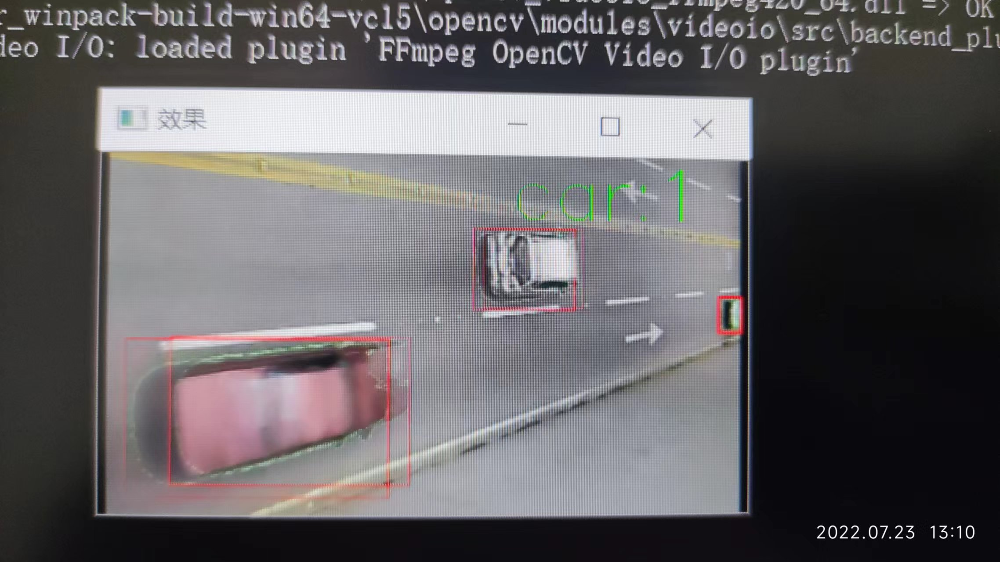

# vehicle_counter

我的邮箱: TwithZ@163.com, 欢迎交流讨论.

[视频演示地址](https://www.bilibili.com/video/BV1B14y1t7cc/?spm_id_from=333.999.0.0&vd_source=939818502857687a4a334c7a40d2c98a).

这是一个基于opencv的简单的车辆计数小项目. 效果图如下:

## 简介:
## 1. 项目背景
起因是跟学姐做一个项目, 主要是为了监测大桥的状况, 这里需要用到大桥在某段时间内通过的车辆的总重量, 所以需要一个对通过大桥的车辆进行计数的功能.
## 2. 方法
最开始考虑车辆都是在运动的, 而其他位置大多处于静止或运动较慢, 所以就想着找到图像中运动的部分, 所以使用了**帧差法**来做, 但是实际测试发现, 实际效果并不是很好, 噪声很多, 处理起来比较麻烦. 而且如果对于行驶速度很慢的车辆, 更难易判断是否是车辆.
后来我又考虑到摄像头是安装在大桥上方的, 处于固定位置, 所以背景基本是不变的, 所以我又考虑使用**背景减除**的方法, 即将视频流的图像减去背景图像, 便可以在图像中找到车辆. 经过测试发现, 这种方法效果很好, 噪声少, 处理起来比较方便.
## 3. 一个小问题
就是怎么判断通过车辆的个数?
由于图像中还是有噪声的, 所以并不是每一帧图像都能把图像中的车辆找出来, 也就是车辆的矩形框并不一定是连续出现的, 这给判断车辆的个数又造成了一定的困难.
**解决办法**: 这里我在图像中设置了一条线, 当有矩形框(车辆)完整通过了这条线之后, 计数值就会加1. (这里就不细说了, `./main.cpp`代码中有体现)

---
2023年8月20日19:33:38